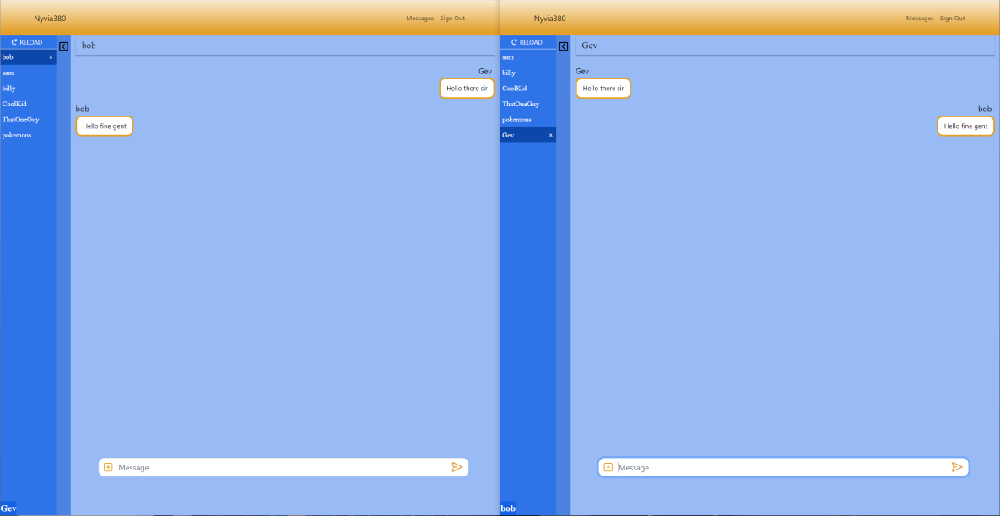

# nyvia380

My Project for COMP 380 and my team

## Spring Boot WebSocket Chatting Application

A Spring Boot-based chat application powered by WebSockets. The application leverages a multi-model Spring Boot RESTful API, with MongoDB for data storage and WebSockets for real-time communication. It features JWT authentication for enhanced security, custom exception handling for tailored business logic, and HTTP interactions.

### Architecture Overview:

The API adheres to MVC and DTO design patterns, complementing Spring's Model-Service-Controller architecture. MongoDB serves as the go-to data persistence solution, while WebSockets enable seamless real-time communication. Through the adept utilization of Spring Beans and Dependency Injection, the application promises modularity, flexibility, and ease in testing, feature expansion, and maintenance.

### MongoDB & WebSockets:

- **MongoDB**: A flexible, schema-free database perfect for the needs of a multi-model application.
- **WebSockets**: Facilitates real-time communication, essential for instant messaging and dynamic data updates.

### Authentication & Exception Handling:

- **JWT Authentication**: Assures secure access through JWT tokens.
- **Custom Exception Handling**: Boosts error resilience by addressing HTTP and database connection exceptions specifically.

### Testing & Tools:

Comprehensive testing ensures the application's reliability:

- **JUnit 5**: For unit testing.
- **Mockito**: Used in tandem with JUnit for integration testing.
- **Postman**: Aids in testing API endpoints.

### Additional tools include:

- **Maven**: Project management.
- **Git**: Version control.
- **React.js**: For crafting the client-side interface.

## Development Setup

### Prerequisites:

- **IntelliJ IDEA Ultimate**: Preferably obtained through a student email for free access.

- **Java 11 SDK**: Ensure it's installed and properly set up.

- **Git**: While IntelliJ offers integrated Git support, having Git installed is essential.

- **MongoDB**: Used for database storage. It's advisable to also install Mongo Compass for easier database navigation and management.

### Collaboration & Project Management:

- **Asana**: A comprehensive tool for project and task management.

- **Code With Me**: A collaborative plugin for IntelliJ IDEA that enables real-time collaborative coding.

- **Discord**: Ideal for team chats, meeting calls, and even screen sharing sessions.
